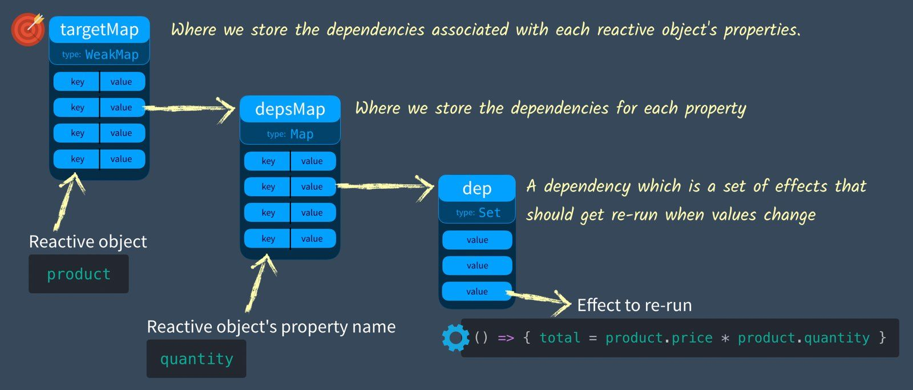

# Vue Reactive 模块源码分析
## 目的
- 学习 Vue.js 设计模式
- 提高 Vue 项目的 debugger 技巧
- 能够单独使用 reactive 模块，做一些骚操作

## Vue Reactive 源码组成
[Vue3 库 github 地址](https://github.com/vuejs/core/tree/main/packages/reactivity/src)

| 文件名          | 作用                                           |
| --------------- | ---------------------------------------------- |
| effect.ts       | 定义 effect，track，trigger                    |
| deps.ts         | 定义 targetMap, depsMap, deps                  |
| baseHandlers.ts | 定义 proxy 处理函数: get, set                  |
| reactive.ts     | 定义 reactive 函数将传入的 object 转换为 proxy | 
| ref.ts          | 定义 ref                                       |
| computed.ts     | 定义 computed                                  |
| index.ts        | 合并模块并输出                                 |
| ...             | ...                                            |
## 什么是响应式
> [Vue官网：什么是响应式](https://cn.vuejs.org/guide/extras/reactivity-in-depth.html)
- JS 原生不支持响应式，没有可直接利用的 JS 底层 API，或是浏览器 API。

```JS
let product = { price: 5, count: 2 }
let total = product.price * product.count

console.log(`now total is ${c}`) // now total is 10
product.price = 10
console.log(`now total is ${c}`) // now total is 10

// 这里的 console.log 只是用作示例
// 实际场景可指代模板渲染，dom 的更新等行为

```

在理想的响应式系统中，上面第二个 console.log 中 total 的值应该是 20

## 响应式 在 Javascript 中实现

```JS
let product = { price: 5, count: 2 }
let total = product.price * product.count

// effect 是约定俗成的命名，指一个执行后可以更新数据状态的 函数
const effect = () => {
	total = product.price * product.count
}

console.log(`now total is ${total}`) // now total is 10
product.price = 10

effect()

console.log(`now total is ${total}`) // now total is 20

```

effect 函数是响应式系统中的核心，effect 中的内容根据业务逻辑而定，但是一定满足执行 effect 可以更新数据的状态。

Vue3 的响应式系统的内部 就是一个能 自动收集effect, 自动储存 effect，自动执行 effect 的系统。并且在封装后，用户几乎无法感知它们。

## Vue 3 中的响应式

### 核心概念：effect, track, trigger, deps

- effect：是可以更新数据的状态的函数
- track：用于收集 effect
- trigger：用于触发 effect
- deps: 用于储存 effect

#### 例子
以上面的例子 total 为例：

在 product.price 发生改变后，track 会将 effect 收集进 deps 中，Vue 会在合适的时机触发 trigger，执行 deps 中所有的 effect。 执行后 total 的值就会变为最新的。

```js
let product = { price: 5, count: 2 }
let total = null

// effect 能更新 total 值
let effect = () => { 
	total = product.price * product.count
} 
effect()

// 使用 Set 能过滤完全一样的 effect, 上面的 effect 执行2次和执行1次 并没有什么区别
let dep = new Set()

// track 函数将 effect 添加一个容器（dep）中，统一更新
function track() { 
	dep.add(effect)
}

// trigger 函数运行容器（dep）中的所有 effect，使数据变为最新的
function trigger() {
	dep.forEach( effect => effect() )
}


console.log(`now total is ${total}`) // now total is 10

product.price = 10
track() // 每次数据变化，调用 track （追踪变化）收集 effect
trigger() // 执行 dep 中的 effect， 使数据值变为最新

console.log(`now total is ${total}`) // now total is 20
```

### 全局的 dep 容器

上面的 dep 其实只是 product.price 的依赖，**对于所有对象的每一个属性**，Vue 都为其配套一个 dep，来储存和其相关的 effect，以便在该属性变化时，触发其中的 effect 来更新数据。

所以在 Vue 中，只真正的 dep容器分为 3 层

- 储存对象之间的关系的 targetMap 【WeakMap 类型，key 只能为 object】
- 储存对象和属性关系的 depsMap【Map 类型，key 是属性名】
- 存储对象属性 effect 的 dep 【Set 类型】



在这样的 deps 结构下，track 和 trigger 函数需要传入需要存入和触发的 object 和 key

改写为下面的形式：

```JS
// targetMap 储存了所有的响应式对象的需要 re-run 的 effect
const targetMap = new WeakMap()

// track 现在需要传入 响应式对象名:target 和属性名:key
function track(target, key) {
  // 获取到 target 对象的 depsMap
  let depsMap = targetMap.get(target) // 这个 depsMap 是 target 全部属性的 dps 集合

  if (!depsMap) {
    // There is no map.
    targetMap.set(target, (depsMap = new Map())) // Create one
  }

  let dep = depsMap.get(key) // Get the current dependencies (effects) that need to be run when this is set
  if (!dep) {
    // There is no dependencies (effects)
    depsMap.set(key, (dep = new Set())) // Create a new Set
  }

  dep.add(effect) // Add effect to dependency map
}

function trigger(target, key) {
  const depsMap = targetMap.get(target) // Does this object have any properties that have dependencies (effects)
  if (!depsMap) {
    return
  }

  let dep = depsMap.get(key) // If there are dependencies (effects) associated with this
  if (dep) {
    dep.forEach(effect => {
      // run them all
      effect()
    })
  }
}

// ========== 
let product = { price: 5, count: 2 }
let total = 0
let effect = () => {
  total = product.price * product.count
}

track(product, 'count')
effect()
console.log(total) // --> 10

product.count = 3
trigger(product, 'count')
console.log(total) // --> 15
```

### 自动化 track 和 trigger

上面的 effect 需要手动 track 和 trigger，在 Vue3 中将通过 Proxy 和 Reflect 实现其自动化。

### Proxy 和 Reflect 简介

#### Proxy
[MDN proxy](https://developer.mozilla.org/zh-CN/docs/Web/JavaScript/Reference/Global_Objects/Proxy)
[阮一峰 ES6 Proxy](https://es6.ruanyifeng.com/#docs/proxy)
> Proxy 可以理解成，在目标对象之前架设一层“拦截”，外界对该对象的访问，都必须先通过这层拦截，因此提供了一种机制，可以对外界的访问进行过滤和改写。Proxy 这个词的原意是代理，用在这里表示由它来“代理”某些操作，可以译为“代理器”。
> ```js
> var proxy = new Proxy(target, handler);
> ```

和 Object.defineProperty 类似，可以拦截对象的 get , set 操作

```js
var obj = { time: 2022 }
var proxy = new Proxy(obj, {
  get: function(target, propKey) {
    return 35;
  }
});

proxy.time // 35
proxy.name // 35
proxy.title // 35
obj.time // 2022
```

- 但是和 Object.defineProperty 不同的是，proxy 不会改变源对象，而是会返回一个新的 proxy 对象。

#### Reflect
[阮一峰 ES6 Reflect](https://es6.ruanyifeng.com/#docs/reflect)

Reflect 是比较高级的特性，但是在这里主要功能仅有一个
> `Reflect`对象的方法与`Proxy`对象的方法一一对应，只要是`Proxy`对象的方法，就能在`Reflect`对象上找到对应的方法。这就让`Proxy`对象可以方便地调用对应的`Reflect`方法，完成默认行为，作为修改行为的基础。也就是说，不管`Proxy`怎么修改默认行为，你总可以在`Reflect`上获取默认行为。

```JS
var obj = new Proxy({}, {
  get: function (target, propKey, receiver) {
    console.log(`getting ${propKey}!`);
    return Reflect.get(target, propKey, receiver);
  },
  set: function (target, propKey, value, receiver) {
    console.log(`setting ${propKey}!`);
    return Reflect.set(target, propKey, value, receiver);
  }
});
```

Reflect 保证了取值和赋值的默认行为能被正确的执行

只需要把 handler 函数的入参 原封不动的传入 Reflect 的同名属性即可

Vue 将 proxy 的创建封装了一下:

```JS
function reactive(target) {
  const handler = {
    get(target, key, receiver) {
      console.log('Get was called with key = ' + key)
      return Reflect.get(target, key, receiver)
    },
    set(target, key, value, receiver) {
      console.log('Set was called with key = ' + key + ' and value = ' + value)
      return Reflect.set(target, key, value, receiver)
    }
  }
  return new Proxy(target, handler)
}

let product = reactive({ price: 5, quantity: 2 }) // <-- Returns a proxy object
product.quantity = 4 // Set was called with key = quantity and value = 4
console.log(product.quantity) // Get was called with key = quantity
// 4
```
> 这就是为什么 Vue3 中的响应式对象在控制台的打印结果都是 Proxy

> 这里 reactive 函数的参数 target，就是 targetMap 中 target 的由来 
---
### 使用 Proxy 实现自动化 track 和 trigger

> 在 get 中调用 track
> 在 set 中调用 trigger

修改 reactive 方法：

现在这个方法会将传入的对象改为 响应式的 proxy 对象，并且能在 get 被调用时执行 track 收集 effect，在 set 被调用时 使用 trigger 执行 effect
```JS
const track = () => { /** ... */ }
const trigger = () => { /** ... */ }

function reactive(target) {
  const handler = {
    get(target, key, receiver) {
      let result = Reflect.get(target, key, receiver)
	  // Track
	  track(target, key)
      return result
    },
    set(target, key, value, receiver) {
      let oldValue = target[key]
      let result = Reflect.set(target, key, value, receiver)
      if (result && oldValue != value) { // Only if the value changes 
        // Trigger
        trigger(target, key)
      } 
      return result
    }
  }
  return new Proxy(target, handler)
}
```

### 将所有的代码合并 

```JS
const targetMap = new WeakMap() // targetMap stores the effects that each object should re-run when it's updated
function track(target, key) {
  // We need to make sure this effect is being tracked.
  let depsMap = targetMap.get(target) // Get the current depsMap for this target
  if (!depsMap) {
    // There is no map.
    targetMap.set(target, (depsMap = new Map())) // Create one
  }
  let dep = depsMap.get(key) // Get the current dependencies (effects) that need to be run when this is set
  if (!dep) {
    // There is no dependencies (effects)
    depsMap.set(key, (dep = new Set())) // Create a new Set
  }
  dep.add(effect) // Add effect to dependency map
}
function trigger(target, key) {
  const depsMap = targetMap.get(target) // Does this object have any properties that have dependencies (effects)
  if (!depsMap) {
    return
  }
  let dep = depsMap.get(key) // If there are dependencies (effects) associated with this
  if (dep) {
    dep.forEach(effect => {
      // run them all
      effect()
    })
  }
}

function reactive(target) {
  const handler = {
    get(target, key, receiver) {
      let result = Reflect.get(target, key, receiver)
      track(target, key) // If this reactive property (target) is GET inside then track the effect to rerun on SET
      return result
    },
    set(target, key, value, receiver) {
      let oldValue = target[key]
      let result = Reflect.set(target, key, value, receiver)
      if (result && oldValue != value) {
        trigger(target, key) // If this reactive property (target) has effects to rerun on SET, trigger them.
      }
      return result
    }
  }
  return new Proxy(target, handler)
}

// ==============
let product = reactive({ price: 5, quantity: 2 })
let total = 0

let effect = () => {
  total = product.price * product.quantity
}
effect() // 手动触发

console.log('before updated quantity total = ' + total) // total = 10
product.quantity = 3
console.log('after updated quantity total = ' + total) // total = 15
```

### 保证 track 只在 effect 中触发：activeEffect

至此已经构建了一个最基本的响应性系统，但是目前有一个问题：

> 现在每次访问响应式对象时（比如在console.log 时），都会触发 proxy.get，进而触发 track，将 effect 收集到 dep 中。如果 effect 的值有变化，那么不相关的 effect 将被添加到 dep 中。

举例：现在新增一个变量 salePrice

```JS
let product = reactive({ price: 5, count: 2 })
let salePrice = 0 // add
let total = 0

let effect = null // 全局变量
effect = () => {
  total = product.price * product.count
}
effect()

effect = () => {
  salePrice = product.price * 0.9
}
effect()

// 如果我们此时调用 product.count
console.log(product.count)
// salePrice = product.price * 0.9 的 effect 将被添加到 count 属性的 dep 中

```

Vue 通过全局变量 activeEffect 实现了只在 effect 中触发 track ,

```JS
let activeEffect = null // 全局变量

// effect 现在是一个包装函数
function effect(eff) {
	activeEffect = eff
	activeEffect()
	activeEffect = null
}
// track 只在 activeEffect 存在时收集 effect
function track(target, key) {
  if (activeEffect) { // add
	  let depsMap = targetMap.get(target)
	  if (!depsMap) {
	    targetMap.set(target, (depsMap = new Map())) // Create one
	  }
	  let dep = depsMap.get(key)
	  if (!dep) {
	    depsMap.set(key, (dep = new Set()))
	  }
	  dep.add(activeEffect) // change
  }
}

let product = reactive({ price: 5, count: 2 })
let salePrice = 0
let total = 0

// 以前的 effect 现在被当作参数传入
effect(() => {
  total = product.price * product.count
})
// effect() // 删除

// 现在 effect 传入后，被赋给全局变量 activeEffect 后执行
// 在执行时，触发 proxy.get 执行 track, 此时 activeEffect 有值
// 所以 track 正常把 effect 收集到 dep 中
effect(() => {
  salePrice = product.price * 0.9
})
// effect() // 删除

// 现在我们此时调用 product.count, proxy.get 调用 track
// 此时 activeEffect 为 null，所以 track 将不做任何操作
console.log(product.count)

```
---
> 更多Reactive API参考 [Vue 官方文档 Reactive API](https://v3.cn.vuejs.org/api/basic-reactivity.html#reactive)

## mileStone
- [x] reactive 的实现
- [x] track 收集依赖
- [x] trigger 触发依赖
- [ ] ref 的实现
- [ ] computed 的实现

## 问题

## 引用
- [Vue mastery: 编译器模块 课程地址（英文官网视频带源码和图片）](https://www.vuemastery.com/courses/vue-3-reactivity/vue3-reactivity)
- [Vue mastery: 编译器模块 课程地址（B站带翻译）](https://www.bilibili.com/video/BV1SZ4y1x7a9)
- [Vue mastery: vue 源码解析 课程地址（B站带翻译）](https://www.bilibili.com/video/BV1rC4y187Vw)
- [Vue3 源码简化 github 仓库](https://github.com/cuixiaorui/mini-vue)