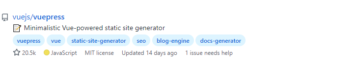

# 从零开始的 blog 建设指北
## summary
目的：在十分钟（左右）内开发并部署一个最简单的可用的静态博客站点

### 技术栈：
- Markdown（写文章） + VuePress（开发网站） + Github（代码存储） + Vercel（部署）

（下面是介绍，不感兴趣可跳过）
- [VuePress](https://vuepress.vuejs.org/zh/)

	- 在2018年由Vue官方团队出品。许多的 Vue 生态的静态文档站点都由 VuePress 生成。（其酷炫的绿主题色看很久也不会想吐）
	- VuePress 由 webpack 驱动，Vue官方团队在深深的爱上 Vite 后。毅然决然的重新弄了一个 [VitePress](https://vitepress.vuejs.org/)，但是目前还处于 alpha 阶段（完成度：Alpha < Beta < Release）

VuePress 的竞品还有：

[Hexo](https://hexo.io/zh-cn/)（Node.js）
 

	
 [Hugo](https://gohugo.io/)（Go）
 


[Jekyll](https://jekyllrb.com/)（Ruby）


---
VuePress


VitePress


- [Vercel](https://vercel.com/) 
	- Vercel 平台由 [Vercel团队](https://github.com/vercel) 开发，Vercel 团队还开发了 next.js，而 next.js 正是nuxt.js 的”借鉴“对象。 
	- Vercel 平台可以连接 github，一键完成打包部署分配域名。在blog网站开发完成后，会将代码上传至 github，再使用 Vercel 部署到公网访问。既省去了自己买域名，买服务器；也可以获得博客页面完全的开发权限，同时保证了数据的安全性，避免各大博客平台（简书，csdn）删库跑路。
	- 和 Vercel 类似网站的还有 [Railway](https://railway.app/) 。

---

## implement
### 1. 创建 github 仓库同步至本地
登录 github 创建仓库（不需要勾选生成 README 文件）
clone 空仓库至本地
### 2. 初始化 vuePress
[参考 vuePress 快速上手](https://vuepress.vuejs.org/zh/guide/getting-started.html)

- 初始化 vuepress
```bash
# 初始化 package.json
pnpm init # yarn init / npm init

# 初始化 vuepress
pnpm install -D vuepress
```

- 添加 docs 文件夹，向其中添加 README.md 文件, 内容可以随便写（比如写个测试）。
- 修改 package.json 的启动项：
```JSON
{
  "scripts": {
    // 官网推荐的配置
    // "docs:dev": "vuepress dev docs",
    // "docs:build": "vuepress build docs"
	// 我们修改的配置，因为vercel 自动部署需要使用 build 而非 docs:build
    "dev": "vuepress dev docs", 
    "build": "vuepress build docs"
  }
}
```
- 启动 vuepress
```bash
npm run dev
```

> 此时你应该已经可以看到一个只有搜索栏 和 一个测试文字的页面
> 修改 docs/README.md 文件，本地页面应该可以通过热重载即时更新

此时的页面已经具备了部署的能力，接下来需要简单的美化一下页面。

### 3. 修改 vuepress 配置
这一节会简单配置vuepress，实现标题，导航跳转，静态图片引入功能。
[参考 Vuepress 基本配置](https://vuepress.vuejs.org/zh/guide/basic-config.html)

1. 在 vuepress 目录下添加 /.vuepress 目录，在 .vuepress目录下添加 config.js 文件

在[这里](https://vuepress.vuejs.org/zh/config/#%E5%9F%BA%E6%9C%AC%E9%85%8D%E7%BD%AE)查看vuepress 提供给 config.js 的所有配置

2. 修改 config.js 为以下样式（重启项目生效）
```JS
module.exports = {

  base: "/", // 站点的根路径

  dest: 'public', // 重点：这里决定了build构建的输出目录，改成public才能让vercel识别

  title: 'Blog Name', // 博客名称，会出现在左上角，随便改
}
```

3. 文章跳转

在 docs 目录下添加，test 文件夹，在 test 文件夹下添加 “测试.md”，在里随便写点啥。此时你的文件目录应该像这样


修改 docs/README.md 成下面的样子（这是你的博客首页）
```md
# 测试标题

[测试](./test/测试.md)
```

> `[测试](./test/测试.md)` 是一个 markdown 语法，类似 html 的 \<a\>标签，中括号内是显示的文本，圆括号内是跳转的地址，支持本地地址 ( href ) 和任意的网络链接 ( url )
> 
> 上面的链接会显示成可点击的 "测试"，被点击后会跳转到 ./test/测试.md 文档
这是一个

由于 test 文件是新添加的，所以你还需要重启项目才能看见该文档

重启项目后，你应该可以看到以下界面。


点击测试后会跳转至 测试.md 文档，自动填充路由，并且支持浏览器前后退。
同时在右上角的搜索栏里，会自动收集所有文章的 h1 h2 标签，提供快速检索
左上角的文章标题点击后能快速返回首页

4. 添加静态图片

图片的使用和链接相似，使用 `` 添加。

在  docs 目录下新建 image 文件夹，向其中添加一张图片 test.jpg

再在 docs/test/测试.md 中引用它

```md
# 测试文章标题

```

此时本地服务应该会变成下面的样子 
`http://localhost:8080/test/测试.html`


至此 vuepress 已经可以进行部署了。

### 部署至 vercel 
1. 首先上传所有代码 github（记得忽略 node_modules）
2. 打开 [vercel 官网](https://vercel.com/)，右上角点击登录，使用 github 账号登陆
3. 进入到 dashboard 页面，点击右侧的 + New Project
4. 根据左侧的 **Import Git Repository** 导入刚刚上传的 blog 工程 ，如果你是首次进入，需要根据提示跳转到 github 进行授权，授权后 vercel 才能读取你的代码。
5. 点击 import 跳转至配置页


6. 点击 deploy 开始部署


7. 稍等几秒后，会跳转至部署成功页面


8. 点击左侧的预览框，进入线上地址，和本地一摸一样（图片的加载速度可能变慢），你也可以复制链接到你的手机查看（ vercel 部署的页面不需要梯子也能查看 ）

## one more thing
### vercel 自动部署
在配置的时候，vercel 追踪了 master 分支。如果后续 github 上 master 分支的代码有更新，那么 vercel 会自动拉取新的代码，并打包部署。还会发一封邮件到你的 github 绑定邮箱上，可以说非常贴心了。

### vercel 部署记录
在你的 github 项目里，可以看到右侧出现了一个 Environments 栏


这是你项目的运行环境，目前只有 production 生产环境（因为是 master 分支）。

> 你还可以创建新的分支 比如dev。在 vercel 配置页面（deploy 之前）选择追踪 dev 分支即可。

点击 production，进入 vercel 部署记录，如果你多次部署了该应用，那么看起来会像这样


vercel 会为每一次部署记录一个副本页面，点击右侧的 view deployment 就会进入那一次部署的时候的页面。方便你在两次部署之间对比差异。

更多 [vercel guide](https://vercel.com/guides) 参考