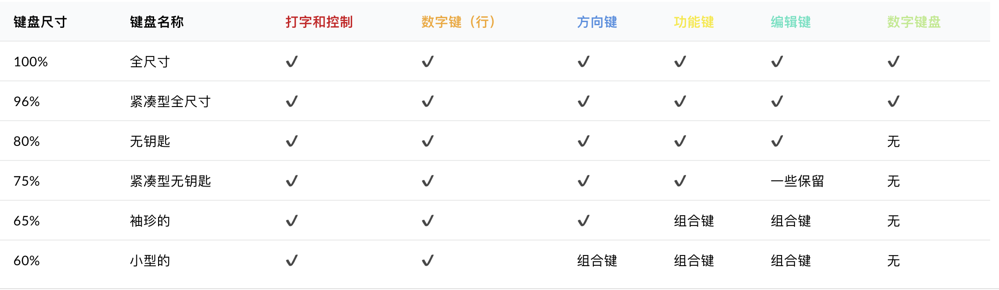
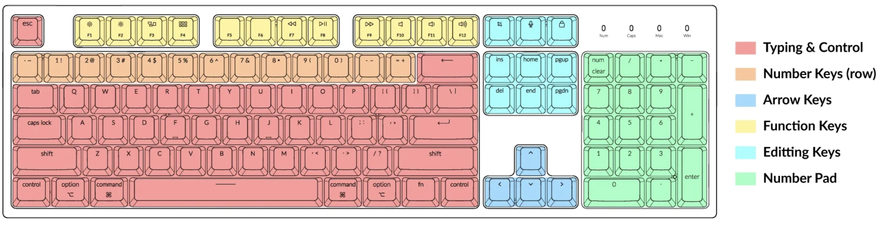
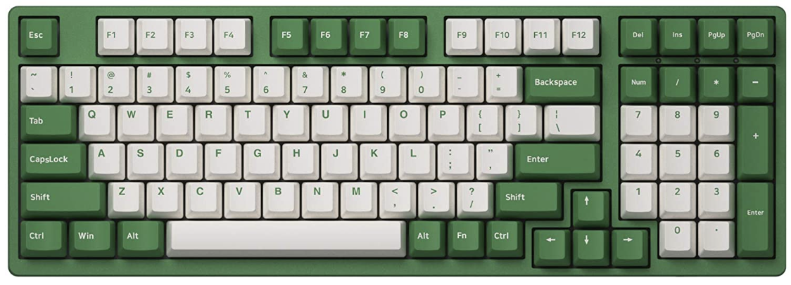
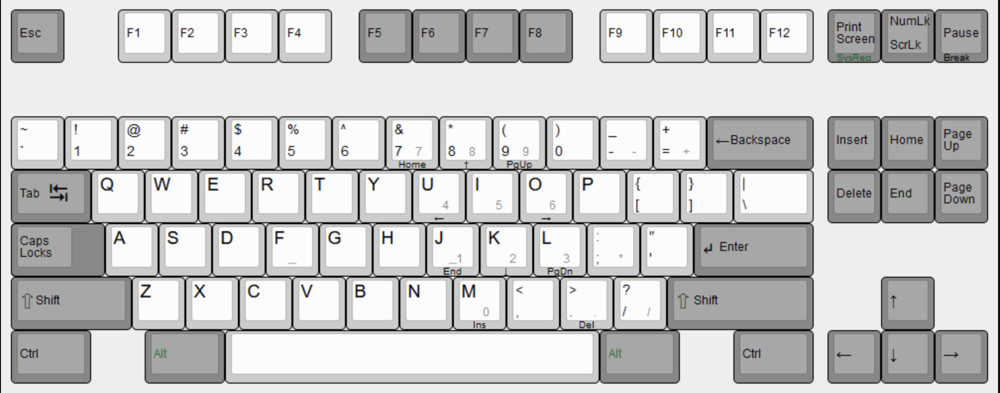
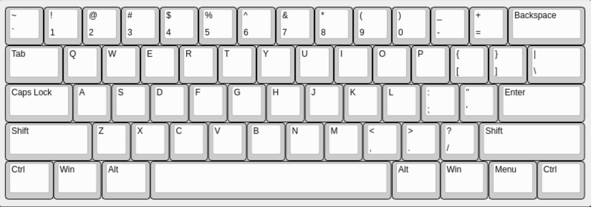

# 不靠谱指北 - 机械键盘

## 机械键盘的差异点
### 键盘布局

<!--  -->
<!-- 
- [键盘布局](https://zhuanlan.zhihu.com/p/443914240)
	- 100% 传统布局，标准键盘为 104 键位

	
	
	- 85% 布局：下图是98键布局，去除很少用到的键位，最大化利用空间。

	

	- 80% 便携布局：常用的便携键盘，去除了右边的数字键区，使键盘的宽度收窄

	

	- 60% 紧凑布局：只保留主键盘区的核心输入功能，需要熟练使用组合键。下图是61键位键盘，也有部分60%键盘是带方向键和部分控制区按键的

	
> 如果你是程序员，不建议你选购 85% 键盘，这类键盘的右 ctrl 和 右 shift 键和方向键这些编程常用的键位被调整过。会有非常大的学习成本。建议在 80% 和 100% 布局中选择你喜欢的。如果对便携有要求 60% 键盘也是不错的选择。
 -->
### 主要差异点
- 轴体
	- 轴类型：至少要知道 **段落轴** 和 **线性轴** 的区别。段落轴会有明显的“咔哒”的手感，线性轴则是直上直下很丝滑。如果分不清，可以多摸摸同事和同学的键盘试一试。
	- 压力范围：明确自己喜欢的压力范围，段落轴中，青轴比茶轴的触发力度要重，预估你自己的指力，和键盘使用的频率来选择轴体
	
>  如果你是经常打字的键盘用户，那么我推荐你使用“段落轴”， 段落轴会在你按下某个键时给你明确的反馈，这在误触其他键时能得到明确反馈，非常有用。
>  
>  如果你是经常玩游戏的键盘用户，那么更加丝滑，触发速度更加优秀的"非段落轴” 键盘就能更快的响应你的操作

- 压力范围：明确自己喜欢的压力范围，段落轴中，青轴比茶轴的触发力度要重，预估你自己的指力，和键盘使用的频率来选择轴体
	- 声音：声音可以通过夹心棉等配件来调整，同样的轴体可能有不一样的声音，但是如果是办公场景还是尽量不要使用声音过大的轴体。
- 键帽
	- 键帽的材质有 PBT，ABS 等，但是不建议作为购买的主要参考指标
- 配件
	- 主要指脚撑，掌托等可有可无的东西，如果确实有需求，可以纳入参考指标
- 重量
	- 重量取决于键盘内部的材质，有的键盘大量使用黄铜或者钢的键盘会明显比较重。如果有便携需求需要甄别
- 外观
	- 纯粹的个人喜好判断，虽然键帽是可以更换的，但是整个键盘的造型是无法修改的。建议慎重考虑

### 选配差异点
- 是否有背光
- 是否有音量（多媒体）控制键或者旋钮
- 是否有夹心垫（影响声音）
- 是否有地垫 （影响防滑和磕碰）
- 是否支持 mac / windows 模式切换
- 是否有独立的切换按钮
	- 部分键盘的开关，模式切换需要用特殊的组合键切换。而有的键盘会单独设立一个切换按钮
- 是否三模 / 双模
	- 三模指机械键盘有三种接入方式，有线，2.4G无线，蓝牙。双模则指有两种接入方式
	- 2.4G无线需要一个发射器接入电脑，反应速度比蓝牙要快，但是不如蓝牙方便
- 是否热插拔
	- 热插拔指机械键盘的轴体可以不通过电烙铁，直接使用工具进行更换。
- 是否有脚撑
- 是否有 2.4g 收纳仓
	- 2.4g 收纳仓指键盘上的一个专门的孔位去存放2.4g无线信号发射器，方便收纳
- 是否支持干电池供电
	- 大部分无线键盘是锂电池供电，但是也有支持干电池供电的键盘作为卖点推出

## 引用

- 推荐 b 站 [龙翔可乐](https://space.bilibili.com/405484897) 老师的机械键盘推荐视频
- [机械键盘的布局](https://zhuanlan.zhihu.com/p/443914240)
- [机械键盘的布局 - 英文](https://www.keychron.com/blogs/news/keyboard-size-layout-buying-guide)