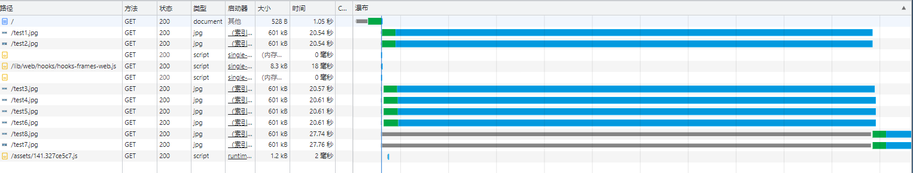

# 浏览器并发请求限制

先说结论：在 Chrome 中的最大请求并发数为 **6**


证明方法：
1. 新建一个文件夹，新建一个如下的 html 页面：该页面在页面打开时加载 8 张图片
```html
<!-- connection.html -->
<html>
  <body>
    
    
    
    
    
    
    
    
  </body>
</html>
```

2. 新建一个如下 JS 文件，当请求为 host:port/ 时响应上面定义的 html 文件，其它情况下则响应图片。示例中用到的图片示例名称须为 `test_img.jpg`，内容可自行定义
```JS
// connection.js
const http = require('http');
const fs = require('fs');
const port = 3010;
http.createServer((request, response) => {
  console.log('request url: ', request.url);
  const html = fs.readFileSync('./connection.html', 'utf-8');
  const img = fs.readFileSync('./test_img.jpg');
  if (request.url === '/') {
    response.writeHead(200, { 'Content-Type': 'text/html' });
    response.end(html);
  } else {
    response.writeHead(200, { 'Content-Type': 'image/jpg' });
    response.end(img);
  }
}).listen(port);
console.log('server listening on port ', port);

```

3. 使用 node 运行 connection.js 后，打开 Chrome 浏览器访问 localhost:3010，在 Network 里调整网络为 3G 能更好的看到效果。

5. 结果：


第七、八张图片前面的灰线是请求等待时间。这意味着它们同时被请求，但是因为浏览器并发数量限制不得不延后。

## 参考文章
https://cloud.tencent.com/developer/article/1803370